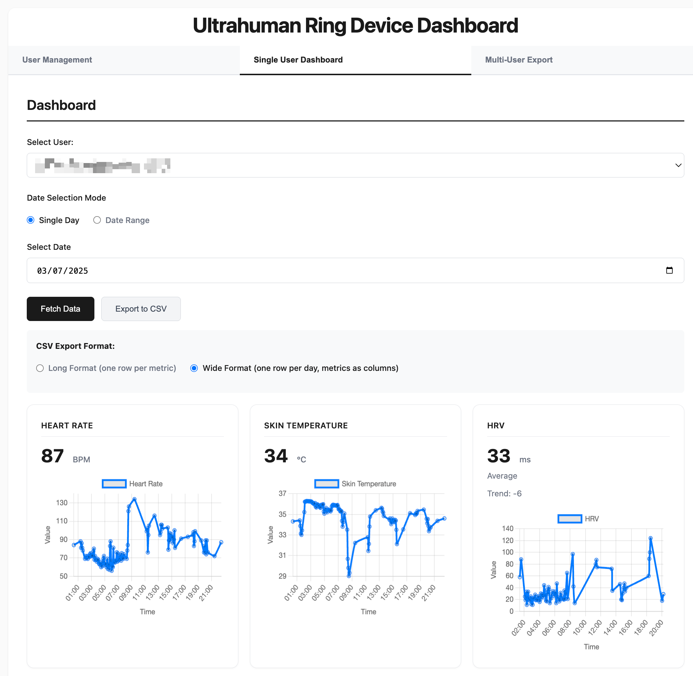

# Ultrahuman Dashboard

A comprehensive Python web dashboard for visualizing and analyzing your Ultrahuman ring data locally. Get detailed insights into your sleep, heart rate, HRV, glucose levels, and more!



---

## How to Cite

If you use this dashboard in your research or find it helpful, please cite it using the information below:

### APA Style
```
Suppiah, H., & Driller, M. (2024). Ultrahuman Dashboard - Personal Health Data Visualization Tool (Version 1.0.0) [Computer software]. https://doi.org/[DOI_PLACEHOLDER]
```

### BibTeX
```bibtex
@software{suppiah_ultrahuman_2024,
  author = {Suppiah, Haresh and Driller, Matthew},
  title = {Ultrahuman Dashboard - Personal Health Data Visualization Tool},
  url = {https://github.com/hareshsuppiah/ultrahuman_dashboard},
  doi = {[DOI_PLACEHOLDER]},
  version = {1.0.0},
  year = {2024}
}
```

### Citation File
This repository includes a `CITATION.cff` file for easy citation management. GitHub will automatically generate citation formats from this file.

---

## What This Project Does

This dashboard provides:
- **Comprehensive Health Analytics**: Sleep patterns, heart rate, HRV, glucose monitoring, and more
- **Advanced Sleep Tracking**: Separate cards for bedtime, wake time, duration, sleep HR, and sleep HRV
- **Interactive Charts**: Real-time visualizations of your health metrics with zoom and pan capabilities
- **Tabbed Interface**: Clean navigation between User Management, Single User Dashboard, and Multi-User Export
- **Dual Export Formats**: Choose between Long Format (detailed) or Wide Format (spreadsheet-friendly)
- **Multi-User Export**: Bulk CSV export for multiple users across date ranges
- **Multi-Day Analysis**: Compare trends across date ranges
- **Privacy-First**: All data stays local on your machine

### Key Features Shown in Dashboard:
- **Heart Rate Monitoring**: Real-time BPM tracking with interactive charts
- **Skin Temperature**: Continuous temperature monitoring throughout the day  
- **HRV Analysis**: Heart Rate Variability metrics with trend analysis
- **Export Options**: Both Long and Wide format CSV exports available
- **Date Selection**: Single day or date range analysis modes

---

## Getting Started

This guide provides step-by-step installation instructions for users new to Python development.

### Step 1: Download the Project

**Option A: Using GitHub (Recommended)**
1. Go to: https://github.com/hareshsuppiah/ultrahuman_dashboard
2. Click the green **"Code"** button
3. Click **"Download ZIP"**
4. Extract the ZIP file to your Desktop or Documents folder

**Option B: Using Git (if you have it)**
```bash
git clone https://github.com/hareshsuppiah/ultrahuman_dashboard.git
```

### Step 2: Install Python and Set Up the Dashboard

Choose your operating system:

## For Mac Users

### Install Python

1. **Check if Python is already installed:**
   - Open **Terminal** (press `Cmd + Space`, type "Terminal", press Enter)
   - Type: `python3 --version`
   - If you see a version number like `Python 3.9.7`, you're good! Skip to Step 2.

2. **Install Python (choose ONE method):**

   **Method A: Using Homebrew (Recommended)**
   ```bash
   # Install Homebrew first (if you don't have it)
   /bin/bash -c "$(curl -fsSL https://raw.githubusercontent.com/Homebrew/install/HEAD/install.sh)"
   
   # Then install Python
   brew install python
   ```

   **Method B: Download from Python.org**
   - Go to [python.org/downloads](https://www.python.org/downloads/)
   - Download the latest Python 3.x version for macOS
   - Double-click the installer and follow the prompts

### Set Up the Dashboard

1. **Open Terminal and navigate to your project folder:**
   ```bash
   cd ~/Desktop/ultrahuman_dashboard-main
   # (adjust the path based on where you extracted the files)
   ```

2. **Create a virtual environment:**
   ```bash
   python3 -m venv venv
   ```

3. **Activate the virtual environment:**
   ```bash
   source venv/bin/activate
   ```
   You should see `(venv)` at the beginning of your terminal prompt.

4. **Install required packages:**
   ```bash
   pip install -r requirements.txt
   ```

5. **Run the dashboard:**
   ```bash
   python src/main.py
   ```

6. **Open your web browser and go to:**
   ```
   http://localhost:8000
   ```

## For Windows Users

### Install Python

1. **Check if Python is already installed:**
   - Press `Win + R`, type `cmd`, press Enter to open Command Prompt
   - Type: `python --version`
   - If you see a version number, skip to Step 2.

2. **Install Python:**
   - Go to [python.org/downloads](https://www.python.org/downloads/)
   - Download the latest Python 3.x version for Windows
   - Run the installer
   - **Important:** Check "Add Python to PATH" during installation
   - Click **"Install Now"**
   - Restart your computer after installation

### Set Up the Dashboard

1. **Open Command Prompt:**
   - Press `Win + R`, type `cmd`, press Enter
   - Or press `Win + X` and select "Command Prompt"

2. **Navigate to your project folder:**
   ```cmd
   cd C:\Users\YourName\Desktop\ultrahuman_dashboard-main
   # (adjust the path based on where you extracted the files)
   ```

3. **Create a virtual environment:**
   ```cmd
   python -m venv venv
   ```

4. **Activate the virtual environment:**
   ```cmd
   venv\Scripts\activate
   ```
   You should see `(venv)` at the beginning of your prompt.

5. **Install required packages:**
   ```cmd
   pip install -r requirements.txt
   ```

6. **Run the dashboard:**
   ```cmd
   python src/main.py
   ```

7. **Open your web browser and go to:**
   ```
   http://localhost:8000
   ```

### Step 3: First Time Setup

Continue to the sections below for database setup and adding your Ultrahuman credentials.

---

## Database Setup

The database is created automatically when you first run the application.

When you run `python src/main.py` for the first time, the application will:

1. Create `database.db` in your project folder
2. Set up the user table with the following structure:
   - `id`: Unique identifier for each user
   - `email`: Your Ultrahuman account email
   - `api_key`: Your Ultrahuman API key
   - `access_code`: Your Ultrahuman access code

### Database Details

**File Location:** `ultrahuman_dashboard/database.db`

**Structure Created Automatically:**
```sql
CREATE TABLE user (
    id INTEGER PRIMARY KEY,
    email VARCHAR(120) UNIQUE NOT NULL,
    api_key VARCHAR(120) NOT NULL,
    access_code VARCHAR(120) NOT NULL
);
```

**Key Points:**
- No manual database setup required
- Database file is created on first run
- Your data stays completely local
- Database file is automatically excluded from GitHub

### Database Management

**If you need to reset your database:**
1. **Stop the dashboard** (Ctrl + C in terminal)
2. **Delete the database file:**
   ```bash
   rm database.db  # Mac/Linux
   del database.db # Windows
   ```
3. **Restart the dashboard** - a fresh database will be created automatically

**If you want to backup your database:**
```bash
cp database.db database_backup.db  # Mac/Linux
copy database.db database_backup.db # Windows
```

### Getting Your Ultrahuman API Credentials

1. **Contact Ultrahuman Support** to request Partnership API access
2. You'll need:
   - Your email address
   - API Key (long string starting with "eyJ...")
   - Access Code (short code like "ABCD1234")

### Adding Your Credentials

1. Start the dashboard for the first time:
   ```bash
   python src/main.py
   ```
   The database.db file will be created automatically.

2. Open the dashboard in your browser: http://localhost:8000

3. Click "Add New User"

4. Enter your information:
   - Email: Your Ultrahuman account email
   - API Key: The long key you received
   - Access Code: The short code you received

5. Click "Save User"

Your credentials are now securely stored in your local database and you can begin viewing your data.

---

## How to Use the Dashboard

The dashboard features three main tabs:

### 1. User Management Tab
- **Add new users** with their Ultrahuman API credentials
- **Edit existing users** to update credentials
- **Delete users** when no longer needed
- **View all registered users** in a clean table format

### 2. Single User Dashboard Tab
#### Viewing Your Data
1. **Select yourself** from the user dropdown
2. **Choose your view:**
   - **Single Day**: See detailed metrics for one specific day
   - **Date Range**: Compare trends across multiple days (up to 30 days)
3. **Pick your date(s)** and click **"Fetch Data"**

### 3. Multi-User Export Tab
#### Bulk CSV Export
1. **Select multiple users** using checkboxes (or use "Select All")
2. **Choose date range** (up to 30 days)
3. **Click "Export Selected Users Data to CSV"**
4. **Monitor progress** as data is fetched for each user/date combination
5. **Download** the combined CSV file with all users' data

### Sleep Analysis Features

**Single Day View:**
- **Bedtime Card**: Exact time you went to sleep
- **Wake Time Card**: Exact time you woke up
- **Sleep Duration Card**: Total hours slept
- **Sleep Heart Rate Card**: Heart rate during sleep with interactive chart
- **Sleep HRV Card**: Heart rate variability during sleep with chart

**Multi-Day View:**
- **Average Sleep Duration**: Across all selected nights
- **Average Bedtime**: With consistency tracking
- **Average Wake Time**: Sleep schedule analysis
- **Sleep Heart Rate Trends**: Average HR during sleep
- **Sleep HRV Trends**: Average HRV during sleep

### Exporting Your Data

#### Single User Export (Dashboard Tab)
1. **Select your data** (single day or date range)
2. **Click "Export to CSV"**
3. **Your CSV will include:**
   - Individual sleep metrics (bedtime, wake time, duration, HR, HRV)
   - All other health metrics
   - Your email for data tracking
   - Clear data quality indicators

#### Multi-User Export (Multi-User Export Tab)
1. **Select multiple users** via checkboxes
2. **Choose date range** (up to 30 days)
3. **Click "Export Selected Users Data to CSV"**
4. **CSV combines all users' data with:**
   - User email column to identify each user's data
   - Same detailed metrics format as single-user export
   - All selected users' data in one comprehensive file

---

## Understanding Your Data

### Sleep Metrics
- **Bedtime/Wake Time**: Exact times with consistency analysis
- **Sleep Duration**: Total time in bed
- **Sleep Heart Rate**: Lowest and average HR during sleep
- **Sleep HRV**: Heart rate variability zones and averages

### Heart Rate Metrics
- **Resting HR**: Daily resting heart rate
- **Heart Rate Trends**: Throughout the day with interactive charts

### Glucose Monitoring
- **Glucose Levels**: Blood glucose measurements
- **Metabolic Score**: Overall metabolic health indicator
- **Glucose Variability**: How much your glucose fluctuates

### Activity Metrics
- **Steps**: Daily step count
- **Active Minutes**: Time spent in active movement
- **VO2 Max**: Cardiovascular fitness indicator

---

## Daily Usage

### Quick Start (After Initial Setup)
1. **Open Terminal/Command Prompt**
2. **Navigate to your project:**
   ```bash
   cd ~/Desktop/ultrahuman_dashboard-main  # Mac
   cd C:\Users\YourName\Desktop\ultrahuman_dashboard-main  # Windows
   ```
3. **Activate virtual environment:**
   ```bash
   source venv/bin/activate  # Mac
   venv\Scripts\activate     # Windows
   ```
4. **Run the dashboard:**
   ```bash
   python src/main.py
   ```
5. **Open browser:** http://localhost:8000

### Stopping the Dashboard
- **Stop the server:** Press `Ctrl + C` in terminal
- **Exit virtual environment:** Type `deactivate`

---

## Project Structure

```
ultrahuman_dashboard/
├── README.md              # This guide
├── requirements.txt       # Python packages needed
├── database.db           # Your personal data (AUTO-CREATED when you first run the app)
├── .gitignore            # Protects your personal data from being uploaded
├── src/                  # Application code
│   ├── main.py          # Main server file (creates database automatically)
│   ├── models/          # Database structure definitions
│   │   └── user.py      # User table structure (id, email, api_key, access_code)
│   ├── routes/          # API endpoints
│   │   ├── user.py      # User management endpoints
│   │   └── metrics.py   # Ultrahuman API data endpoints
│   └── static/          # Web interface
│       └── index.html   # Dashboard interface
├── Samples/             # Example data files
└── venv/               # Virtual environment (CREATED DURING SETUP)
```

**Key Files Explained:**
- **database.db**: SQLite database created automatically on first run
- **models/user.py**: Defines the database table structure
- **main.py**: Contains the database creation code (`db.create_all()`)
- **.gitignore**: Ensures database.db never gets uploaded to GitHub

---

## Troubleshooting

### Common Errors and Solutions

**"Python not found"**
```bash
# Solution: Make sure Python is installed and in PATH
python3 --version  # Try python3 instead of python on Mac
```

**"Permission denied" (Windows)**
```powershell
# Solution: Run PowerShell as Administrator, then:
Set-ExecutionPolicy -ExecutionPolicy RemoteSigned -Scope CurrentUser
```

**"Can't access localhost:8000"**
- Make sure the Python script is running without errors
- Check if another app is using port 8000
- Try restarting the dashboard

**"No module named 'flask'"**
```bash
# Solution: Make sure virtual environment is activated
# You should see (venv) in your terminal prompt
pip install -r requirements.txt
```

**Database Issues**
- The database file (`database.db`) is created automatically when you first run the app
- It stays on your local machine and is never uploaded to GitHub
- If corrupted, just delete it and restart the app - it will be recreated automatically

### Need Help?

1. **Check you completed ALL installation steps**
2. **Verify your virtual environment is activated** (look for `(venv)` in terminal)
3. **Read the error message carefully** - it usually tells you what's wrong
4. **Try restarting your terminal** and starting over
5. **Make sure you're in the correct folder** when running commands

---

## Privacy & Security

- All data stays on your machine - nothing is sent to external servers
- Database file is excluded from GitHub - your personal data never gets uploaded
- API keys are stored locally - only you have access
- No cloud dependencies - works completely offline after setup

---

## Features Overview

### Dashboard Features
- **Tabbed interface** with User Management, Single User Dashboard, and Multi-User Export
- **Real-time health metrics visualization**
- **Interactive charts with zoom and pan**
- **Multi-day trend analysis**
- **Clean, minimalist design**
- **Mobile-responsive interface**

### Export Features
- **Single and multi-user CSV exports**
- **Bulk data export** for multiple users simultaneously
- **Individual sleep metrics as separate rows**
- **Progress tracking** for bulk operations
- **Data quality indicators**
- **Date range flexibility** (up to 30 days)
- **User email tracking** to identify data sources

### Sleep Analysis
- **Detailed sleep stage breakdown**
- **Heart rate during sleep tracking**
- **HRV monitoring during sleep**
- **Sleep consistency analysis**
- **Bedtime/wake time trends**

---

## Support

This project is designed for personal use with Ultrahuman ring data. If you encounter issues:

1. **Follow the troubleshooting guide above**
2. **Check that your Ultrahuman API credentials are correct**
3. **Ensure your virtual environment is properly activated**
4. **Verify all installation steps were completed**

---

## License

This project is for personal use with Ultrahuman ring data. Keep your API credentials secure and never share them publicly.

