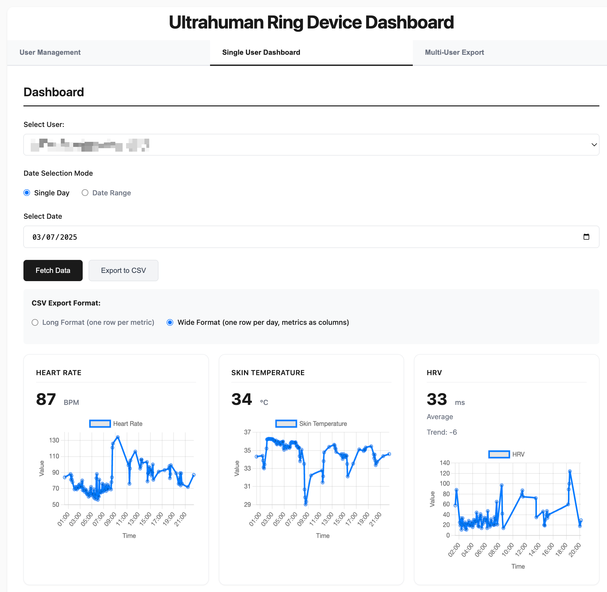

# Summary

The Ultrahuman Dashboard is an open-source Python web application that provides researchers and practitioners with a local, privacy-first interface for visualising, analysing, and exporting health metrics collected by the Ultrahuman Ring wearable device. Built on Flask with a Chart.js frontend, the dashboard retrieves data via the Ultrahuman Partnership API and presents interactive visualisations of sleep architecture, heart rate, heart rate variability (HRV), skin temperature, daily steps, and glucose metrics. All data processing occurs locally and no information is transmitted to external servers beyond the original API call.

The application derives research-grade sleep metrics from raw sleep stage segments, including sleep onset latency (SOL), wake after sleep onset (WASO), and the number of wake episodes, using clinically standard definitions aligned with the American Academy of Sleep Medicine [@berry2017aasm]. A circular mean algorithm [@fisher1993; @mardia2000] is implemented for averaging bedtimes and wake times across multiple nights, correctly handling the midnight boundary problem that causes arithmetic averaging to fail for time of day data. Dual CSV export formats (long and wide) support direct import into statistical software for research workflows.

# Statement of Need

Consumer-grade wearable devices are increasingly used in sport science and clinical research for longitudinal monitoring of sleep and physiological metrics [@henriksen2018; @peake2018; @dezambotti2019]. The Ultrahuman Ring is a photoplethysmography (PPG) based smart ring that continuously measures sleep stages, heart rate, HRV, skin temperature, blood glucose trends, and daily activity [@bent2020]. Its Partnership API provides programmatic access to these metrics, but returns raw JSON data without researcher oriented tools for visualisation, aggregation, or structured export.

Two limitations exist with current approaches to working with Ultrahuman Ring data. First, the Ultrahuman consumer application does not expose derived sleep quality metrics such as SOL, WASO, or wake episodes. These metrics are routinely reported in sleep research [@buysse1989; @ohayon2017; @reed2016] but must be computed from the raw sleep stage segments that the API returns. Second, cloud based data processing may conflict with institutional ethics committee requirements for participant data sovereignty, particularly in multi-site studies where data must remain within a specific jurisdiction [@mittelstadt2016; @martinezmartin2018].

# State of the Field

Several open-source tools exist for processing wearable device data. GGIR [@migueles2019] is a widely used R package for processing raw accelerometer data from GENEActiv and ActiGraph devices, generating physical activity and sleep outcomes. The actigraphy and sleep research community also benefits from standardised testing frameworks for consumer sleep trackers [@menghini2021]. For smartwatch platforms, wristpy provides Python processing of accelerometer data from wrist worn devices.

However, none of these tools support the Ultrahuman Ring or its PPG based data model. The Ultrahuman API provides a distinct data structure centred on `sleep_graph.data` segments (typed intervals with Unix timestamps), `quick_metrics` (pre-calculated summaries), and separate metric objects for heart rate, HRV, temperature, steps, and glucose. Processing this specific data structure requires purpose-built tooling. The Ultrahuman Dashboard fills this gap by providing visualisation, metric derivation, and export capabilities tailored to the Ultrahuman Ring data format while maintaining complete local data processing.

# Software Design

The Ultrahuman Dashboard follows a client-server architecture with deliberate simplicity to maximise accessibility for researchers without software engineering backgrounds.

The backend is built with Flask and uses SQLAlchemy with a local SQLite database. This eliminates the need for external database servers. User credentials (email, API key, access code) are stored locally and used to authenticate requests to the Ultrahuman Partnership API. The backend exposes RESTful endpoints for user management (`/api/users`) and metric retrieval (`/api/metrics`), organised as Flask Blueprints for modularity.

The frontend is a single page application using vanilla JavaScript and Chart.js for interactive data visualisation. This avoids build tooling dependencies (Node.js, webpack) and allows the application to run directly from the Flask static file server. Three tab-based views provide user management, individual dashboard analysis, and multi-user bulk export.

Two algorithmic contributions are central to the software. The circular mean implementation addresses the midnight boundary problem that arises when averaging time of day values. Standard arithmetic averaging fails when bedtimes span midnight (e.g., the arithmetic mean of 23:00 and 01:00 is 12:00 noon). The dashboard converts times to angular positions on a 24-hour circle, computes the vector mean using sine and cosine components, and converts back to hours via $\bar{\theta} = \text{atan2}\!\left(\sum \sin\theta_i,\, \sum \cos\theta_i\right)$. An automatic detection function determines when circular averaging is needed by checking whether the time values span the midnight boundary.

The derived sleep metrics module processes raw `sleep_graph.data` segments to calculate SOL (duration of the first awake segment if it occurs at sleep onset), WASO (cumulative duration of all subsequent awake segments), and wake episodes (count of post onset awakenings). These calculations satisfy the invariant SOL + WASO = total awake time, providing an internal consistency check. Both the API-reported total sleep value and the derived total (deep + light + REM) are exported, allowing researchers to compare and validate.

Data export supports two formats: a long format (one row per metric per date) suited to tidy data analysis in R or Python, and a wide format (one row per date with all metrics as columns) suited to spreadsheet based workflows. Both formats include user email, separate bedtime and wake date columns, and Unix timestamps for precise temporal analysis.

{ width=100% }

# Research Impact

The Ultrahuman Dashboard enables researchers to collect and analyse wearable ring data while satisfying ethics committee requirements for local data storage. The software has been archived on Zenodo [@suppiah2024zenodo] under the MIT licence, following FAIR data principles [@wilkinson2016] and software citation standards [@smith2016]. The derived sleep metrics (SOL, WASO, wake episodes) and the circular mean algorithm for time averaging are applicable to any wearable sleep monitoring study, regardless of device manufacturer.

The dual export format design supports both exploratory analysis and formal statistical workflows. The wide format CSV can be imported directly into SPSS or Excel for clinical reporting, while the long format aligns with tidy data principles used in R and Python. Multi-user bulk export enables research teams to extract data for entire participant cohorts in a single operation.

The software is designed for extensibility. The modular route structure and standardised data processing pipeline can be adapted to support other wearable devices that provide similar API access. The Python implementations of the circular mean and sleep metric algorithms in `src/algorithms.py` are independently testable and reusable outside the dashboard context, with a comprehensive test suite of 57 automated tests covering both the algorithms and the Flask application.

# AI Usage Disclosure

Generative AI tools (Claude, Anthropic) were used during development to assist with code scaffolding, test suite generation, and documentation drafting. All AI-generated outputs were reviewed, edited, and validated by the authors. The core software design decisions, algorithmic implementations (circular mean, derived sleep metrics), and architectural choices were made by the human authors. The research direction, clinical definitions, and scholarly content of this paper reflect the authors' domain expertise.

# Acknowledgements

The authors acknowledge the Ultrahuman Partnership API programme for providing data access.

# References
